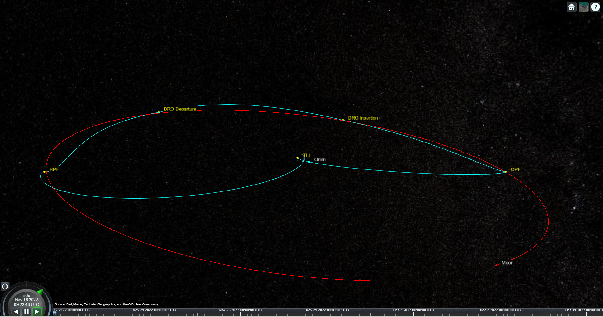

# Lunar Mission Trajectory MATLAB Code Inspired by the Artemis I Mission

Inspired by Orion and the Artemis I mission, this example simulates a lunar mission trajectory in MATLAB® and Simulink®.  The example begins shortly after Trans-Lunar Injection (TLI) on November 16 2022, and models Outbound Powered Flyby (OPF), Distant Retrograde Orbit (DRO) insertion and departure, and Return Powered Flyby (RPF).  The example uses point-mass Earth and moon gravitational models and JPL Ephemeris table DE405 for moon position.

Required products:
1) MATLAB R2022b or later
2) Simulink
3) Aerospace Toolbox&trade;
4) Aerospace Blockset&trade;

To run the example:
1) Make sure lunarMissionModel.slx and lunarMission.mlx are in the current working folder.
2) Install ephemeris data (follow instructions provided here: https://www.mathworks.com/help/aerotbx/ug/install-data-for-aerospace-products.html).
3) In MATLAB R2022b, run the live script artemis1Mission.mlx.
4) After the live script executes, a satellite scenario viewer will be launched to visualize the mision trajectory. You can interact with the viewer in the following ways:
   - Use the playback controls located at the bottom of the satellite scenario viewer window to control the playback speed and direction.
   - Left-click and hold anywhere inside the satellite scenario viewer window to pan the camera.
   - Adjust the zoom level using the scroll wheel.
   - Double-click on Orion or the Moon to focus the camera on them.
   - Click the "Home" button to reset the camera view.

Copyright 2022 The MathWorks, Inc.
 
